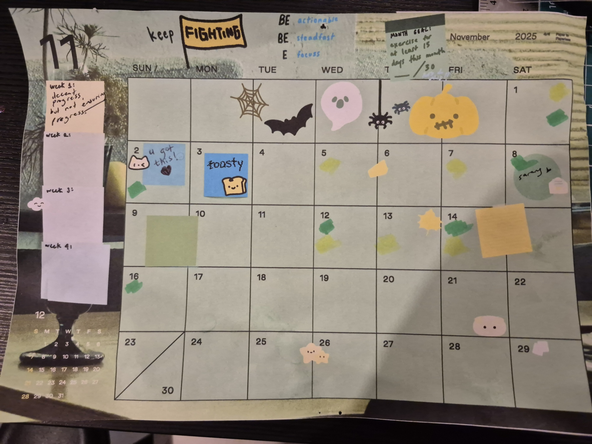

yellow = exercised  
 green = active

## Monthly Stats

- **Workout Days**: 6 out of 30 days (20%)
- **Active Days**: 6 out of 30 days (20%)
- **Types of Movement**: Brazilian Jiu Jitsu

## Highlights

### Best Workouts
I love learning from the different instructors in the gym, they have vastly different teaching styles and I like working with them both.

### Personal Records
A record on how tired I got when rolling at the end of class, yeah.

### Consistency Wins
The momentum of the previous day really helped with being active within the next one.

## Challenges
I was progressing really well in the first half of the month. First and second week I hit 3/7 days, but I got the flu in the third week, which progressed to the fourth. I knew recovery was priority, and I wasn't going to work out just for the sake of stats.

## Goals for Next Month
I'm still going to try to be active and exercise at least three days a week, but it's more of a loose goal since I have to prioritise packing + getting ready to start a new job.