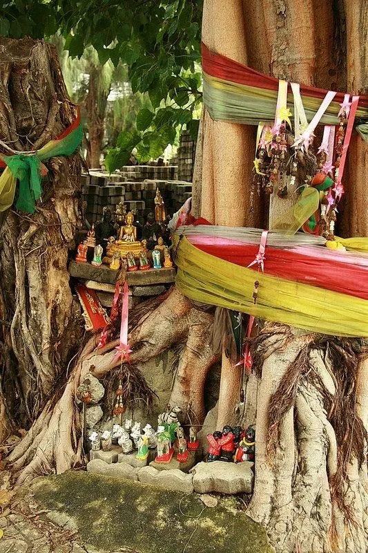

_October 28, 2023_

This tree is an altar

Where I rest after a weary day

The woosh of the wind between the leaves

is a spell that leaves me hypnotised.

In our exchange of breath

I know I’m safe here,

and they are too

I ground my feet in the earth

Just like their roots do.

This tree is an altar

It is where I come to heal,

To learn,

To grow,

To feel.

To see the world with new eyes,

Or old ones, I’m still deciding on which

Head in hand, candle lit

I thrum, I thrum

In tune with spirit

All-encompassing,

Loud,

Made to be known,

I’m reminded quite starkly

Of the place I call home.

This tree is an altar,

This is the place I can rest.

After long days of something

And trying my absolute best

To keep up in a world

That I know was not made for me.

I’m reminded of the breath here

The urge to go back

To the basics sticks its nose in,

Nudges me and tells me

This right here is how it should be

And so it is.   

